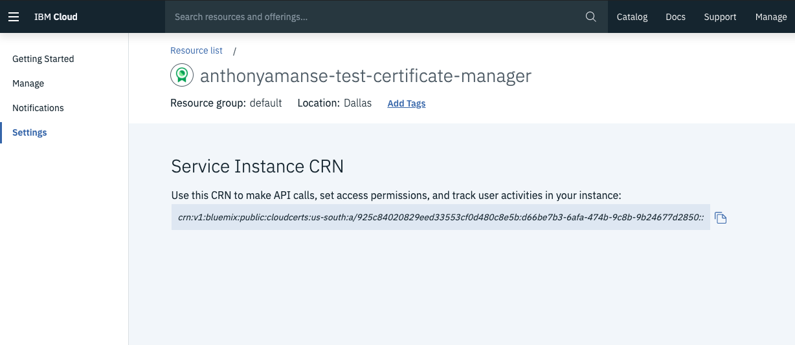
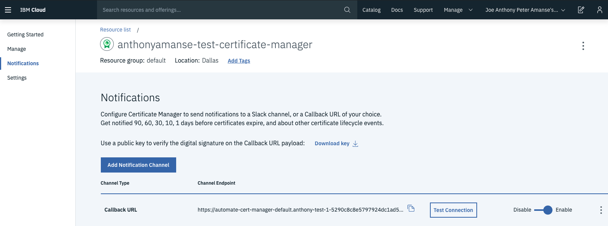
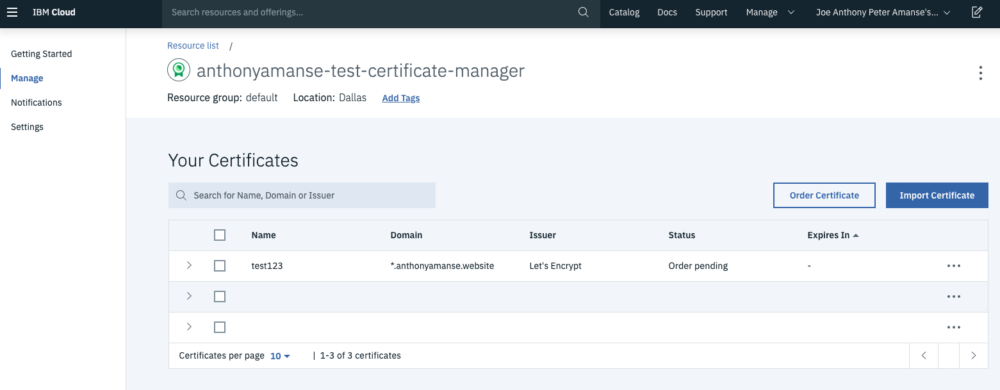

## Automating SSL/TLS Certificate renewal for web domains

Having SSL/TLS Certificates is an integral part of making your users establish secure communication with your application. When certificates are used, this enables HTTPS on your applications that ares using the domain name registered to the certificate. This makes all data transmitted to and from the server encrypted and ensures that no one can easily eavesdrop on your data in motion. Using certificates can prevent man-in-the-middle attacks in your communication between users' clients and your servers. Having certificates in your web application ensures that the data exchanged aren't tampered by anyone. In this digital world, it is important and one of the best practices that web applications use TLS certificates.

### Obtaining SSL/TLS certificates

To obtain SSL/TLS certificates, one must go through a Certificate Authority (CA). The Certificate Authority acts as a trusted third party that validates the requester of the certificate is the actual owner and has control over the domain. Operating systems and browsers has a list of CAs that are identified as trusted. This makes the green lock visible beside the URL that indicates the web application is using HTTPS.

[Let's Encrypt](https://letsencrypt.org/) is one of the trusted Certificate Authorities that provides domain validated certificates that is trusted by most browsers. It uses [ACME](https://ietf-wg-acme.github.io/acme/draft-ietf-acme-acme.html) protocol for validation which sends you a [challenge](https://letsencrypt.org/docs/challenge-types/) to verify that you actually control your domain name. This service is widely used because it's easier and free to get a certificate from Let's Encrypt. One of the downsides of using this Certificate Authority is certificates issued are only good for 90 days. This means that you need to go through the process of getting a new certificate from them.  A problem that most users face is having an outage of their application because of expired certificates. Having to manually request certificates can be cumbersome especially when you need more than one domain. One good thing is that you can easily automate this process with the help of Let's Encrypt's Certbot or other open source software with integration of Let's Encrypt.

### Using the Certbot client

One simple way of getting a certificate through Let's Encrypt is running their Certbot client. You would need to do this manually every time you need new ones like when they expire. You can automate this by writing your own code that executes the certbot client every 90 days. It would also make it easier for you if your DNS provider supports APIs, that way you can complete the challenge without having to go through your DNS provider's website. You can get started with certbot [here](https://letsencrypt.org/getting-started/).

### Automating with Kubernetes Ingress

If you're using Kubernetes and its Ingress resource, you may already be using SSL/TLS certificates on your Ingress resources. If you want to automate the provisioning and renewing of Let's Encrypt certificates with your Ingress resource, [cert-manager](https://github.com/jetstack/cert-manager) can easily be deployed in Kubernetes. cert-manager is a Kubernetes add-on that will automate the process of requesting a certificate and using them in your Ingress resources. This open source software will also complete the challenge for you. This means that you don't need any manual intervention on your DNS provider or application for completing the challenge. Once the certificate is issued, the certificate should show up as a Kubernetes secret in your environment. cert-manager will also keep it up to date as long as it is running.

### Automating with OpenShift Routes

For OpenShift users using Routes, another option they can use is [openshift-acme](https://github.com/tnozicka/openshift-acme). This works similar to cert-manager. It does the automating of provisioning certificates with the use of Routes. This makes it easier for developers request and attach certificates on their OpenShift's Routes. Since both cert-manager and openshift-acme are open source projects, you can take a look at the source code and modify them to fit your needs or even contribute back to their respective upstreams.

### Using a Certificate Manager service

IBM Cloud has a [Certificate Manager](https://cloud.ibm.com/apidocs/certificate-manager) service that helps you manage and deploy SSL/TLS certificates. The service lets your store your certificates and helps you by send you notifications when your certificates are about to expire. The service also lets you order certificates directly from Let's Encrypt. This could help your application prevent outages due to expired certificates. One good thing is the [available APIs](https://cloud.ibm.com/apidocs/certificate-manager) when you want to automate the process of provisioning or renewing your certificates. If you're already using IBM Cloud Internet Services as your DNS provider, you can easily order certificates with Let's Encrypt through the Certificate Manager service. For other DNS providers, you'll need to setup your own callback URL service to receive the challenge sent by Let's Encrypt. The Certificate Manager instance will use the callback URL you set when [events](https://cloud.ibm.com/apidocs/certificate-manager#notification-event-types) such as "Certificate domain validation required", "Ordered certificate issued", etc happen.

#### Deploying in OpenShift

One example where you can deploy your callback service is in OpenShift. The following example will use the Source-to-Image strategy of deploying an application in OpenShift. This allows OpenShift to directly pull from a GitHub repo and build and deploy it directly in the platform. This sample application is using Godaddy as its DNS provider as they provide free use of their APIs. Deploying it in OpenShift would make sense when you already widely use OpenShift to deploy your applications.

To get started on the deployment, you will need to create an [IBM Cloud Certificate Manager](https://cloud.ibm.com/catalog/services/certificate-manager) instance. If your DNS provider is not godaddy, you will need to modify the code to use your DNS provider APIs (to modify DNS records such as adding and removing TXT records from your domain).

Clone the repo https://github.com/IBM/automate-cert-manager. Get your Certificate manager CRN from the Certificate Manager dashboard and modify the `openshift-auto-cert.env.template` with your own values and rename it to `openshift-auto-cert.env`. Your CRN goes in the `ALLOWED_CM` value.



Example `openshift-auto-cert.env`:
```bash
GODADDY_KEY=keysample
GODADDY_SECRET=secretsample
GODADDY_DOMAIN=anthonyamanse.space
CM_REGION=us-south
ALLOWED_CM=crn:v1:bluemix:public:cloudcerts:us-south:a/123:123-456-567::
```

Now you can deploy the app from the command line with your OpenShift CLI (make sure you are logged in)

```bash
oc new-app https://github.com/IBM/automate-cert-manager --env-file=openshift-auto-cert.env
oc expose svc automate-cert-manager
```

To check the status of the build and deployment, do `oc get pods` and you should get a result with something like this:

```bash
$ oc get pods

NAME                                READY     STATUS      RESTARTS   AGE
automate-cert-manager-1-build       0/1       Completed   0          4d
automate-cert-manager-1-xs7gm       1/1       Running     0          4d
```

You also need to enable HTTPS with the exposed route for the callback URL to work with Certificate Manager. To do this, edit the route:

```
$ oc edit routes automate-cert-manager
```

And add the lines `tls:`, `terminate: edge` under the key of `spec:` like:
> _indents are important for a yaml file_

```
spec:
  tls:
    termination: edge
```

Now you can get the route with `oc get routes`.

```
oc get routes
NAME                    HOST/PORT                                                                                                               PATH      SERVICES                PORT               TERMINATION   WILDCARD
automate-cert-manager   automate-cert-manager-default.anthony-test-1-5290c8c8e5797924dc1ad5d1b85b37c0-0001.us-east.containers.appdomain.cloud             automate-cert-manager   8080-tcp           edge          None
```

You can now put your route in the Callback URL of your certificate manager instance. https://`<your-route>`/callback



You can now try ordering a certificate through the Certificate Manager dashboard. The status should go from `Order Pending` to `Valid`. After this, you can now download the certificates through the dashboard. You can also add more automation by using the [Certificate Manager APIs](https://cloud.ibm.com/apidocs/certificate-manager) to fetch the certificates and place them wherever you're using them such as in your load balancer.



#### Deploying in Cloud Functions

Some people would also like prefer to keep costs low and use serverless. Having it in serverless can also save developers time since they would not need to worry about the infrastructure behind their application. This example will use IBM Cloud Functions as the serverless platform. To do this in serverless, clone the repo used above and use and modify `openwhisk-auto-cert.json.template` instead. Then deploy it in IBM Cloud Functions:

```
$ ic fn action create callback-gd actions/callback-gd.js -P openwhisk-auto-cert.json --web true
ok: created action callback-gd

$ ic fn action get callback-gd -r
ok: got action callback-gd
https://us-south.functions.cloud.ibm.com/api/v1/web/QWERTY/default/callback-gd
```

Then use the URL from `ic fn action get callback-gd -r` as your callback URL of your certificate manager instance.

### Summary

With the large amount of data being transmitted today, it is important to have SSL/TLS certificates in your applications especially when your users will have their personal information being exchanged. This makes your application have a secure communication between your users and your users will feel more comfortable in using your app because of the security HTTPS provide. They are also other Certificate Authorities that issue certificates that expire longer than 90 days. They do provide other means of validation like Organization Validation (OV) and Extended Validation (EV) compared to the Domain Validation (DV) from Let's Encrypt. For the users, it's always good to check if the application you're using is HTTPS enabled to ensure that no data can be snooped by others. For developers looking to automate their certificate renewal process for their domain, the ways mentioned above is a good starting point as Let's Encrypt can quickly issue a certificate without additional costs. Setting up a good automation for your certificates will ensure your app won't have an outage because of expired certificates. It also helps when your DNS provider has APIs so that you can automate the completion of the challenge by Let's Encrypt.
